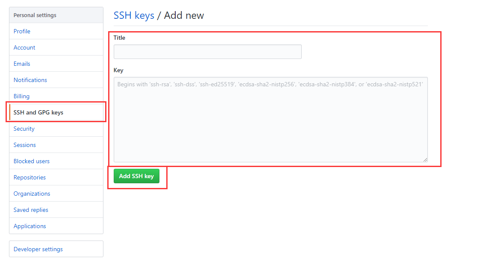
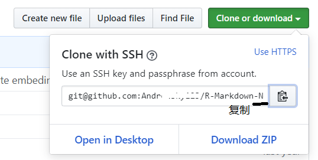
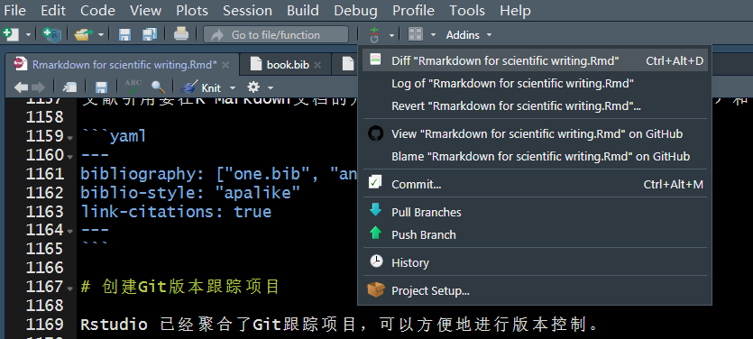

---
authors:
- WSJ
categories: []
date: "2019-08-28T00:00:00Z"
draft: false
featured: false
image:
  caption: ""
  focal_point: ""
projects: []
tags: []
title: "Git用法"
---
# 常用git命令
```
git init // 把这个目录变成Git可以管理的仓库
git add README.md // 把文件添加到仓库
git add . // 把整个目录所有文件全部添加到仓科 
git commit -m "first commit" // 把文件提交到仓库
git remote add origin git@github.com:用户名/仓库名.git // 关联远程仓库
git push -u origin master // 把本地库的所有内容推送到远程库上　　
```
# Git多账号配置SSH Key

假设原有`用户名1`和`邮箱1`，现在想在同一部电脑上增加第二个`用户名2`和`邮箱2`。

## 检查电脑上现有的ssh key

在Git BASH 上输入`$ cd ~/.ssh` 或直接 打开 C:\用户\你的电脑名\.ssh\，查看现有key文件:

`$ ls`

一般会有如下文件：id_rsa, id_rsa.pub，known_hosts。如果显示“No such file or directory”，表示还没有生成任何ssh key，可按照下节方法生成 id_rsa，id_rsa.pub，known_hosts（一路回车，不要重命名）。

## 配置

先将第一个设置为**全局配置**：
```
$ git config --global user.name "用户名1"
$ git config --global user.email "邮箱1"
```
如果在安装Git时已经绑定这个邮箱，这一步可以忽略。

第二个设置为**局部配置**。进入到项目根目录，执行：（其他局部设置都同样操作）

```
git config user.name "用户名2"
git config user.email "邮箱2"
```
## 生成第二个SSH Key

输入下面的代码，就可以生成新的key文件。不要一路回车，对文件进行重命名。

```
$ ssh-keygen -t rsa -C "邮箱2"
```

会显示：

```
Generating public/private rsa key pair.
Enter file in which to save the key (/Users/your_user_directory/.ssh/id_rsa):
```

输入文件名`id_rsa_2`。 然后系统会要你输入加密串（Passphrase）：

`Enter passphrase (empty for no passphrase):`<输入加密串> （一般不设密码）  
`Enter same passphrase again:`<再次输入加密串>  
`ssh key success`

这就生成了用户2的ssh key。

## 为 github 账号配置 ssh key

切换到 github网页，展开个人头像的小三角，点击settings，然后打开 SSH and GPG keys 菜单， 点击 New SSH key 新增密钥


标题最好和仓库名一致, 便于区分。将 id_rsa.pub 文件中 key 粘贴到此，最后 Add SSH key 生成密钥



用户1的SSH keys配置完成。同样操作用户2.

## 配置 config

首先在目录 `C:\用户\admin（电脑名）\.ssh\`创建config文件，内容为：

```
#Default account1 (email1)
Host git@github.com
HostName https://github.com (为了与单个global用户名一致)
PreferredAuthentications publickey
IdentityFile ~/.ssh/id_rsa
     
#second account2（email2）
Host Name2
HostName github.com
PreferredAuthentications publickey
IdentityFile ~/.ssh/id_rsa_2
```

测试一下。输入下面的命令，看看设置git@github.com和Name2是否成功：

$ ssh -T git@github.com

如果出现如下信息，说明设置成功：

Hi <em>username</em>! You've successfully authenticated, but GitHub does not provide shell access.

# 在RStudio中应用Git

项目托管和版本控制一般用Git GUI或Git Bash。然而Rstudio 已经聚合了Git跟踪项目，可以很方便地随时进行版本控制。

假设你已经安装了Git并且准备好了一个Github仓库。

## RStudio全局设置

Go to `Global Options` (from the `Tools` menu)，Click `Git/SVN`, Click `Enable version control interface for RStudio projects`。If necessary, enter the path for your Git or SVN executable where provided. You can also create or add your RSA key for SSH if necessary.


## 建立项目与远程仓库的关联  

复制仓库SSH地址：登进Github仓库，点开`Clone or Download`，右边拷贝SSH clone URL(注意不是网址！)。



打开RStudio，File -> New Project （如果已经存在与Github仓库相同的Project，直接打开`.Proj`文件）,
打开-> Version Control -> Git -> Paste the SSH clone URL。

注意New Project的名字和Github仓库名字要一致。

## 项目更新推送到远程托管

创建成功后，Rstudio自动将工作目录转到新创建的项目，并且在右上操作框出现Git按键，通过Rstudio 或者Github Desktop 来实现Github 托管项目都可以。



