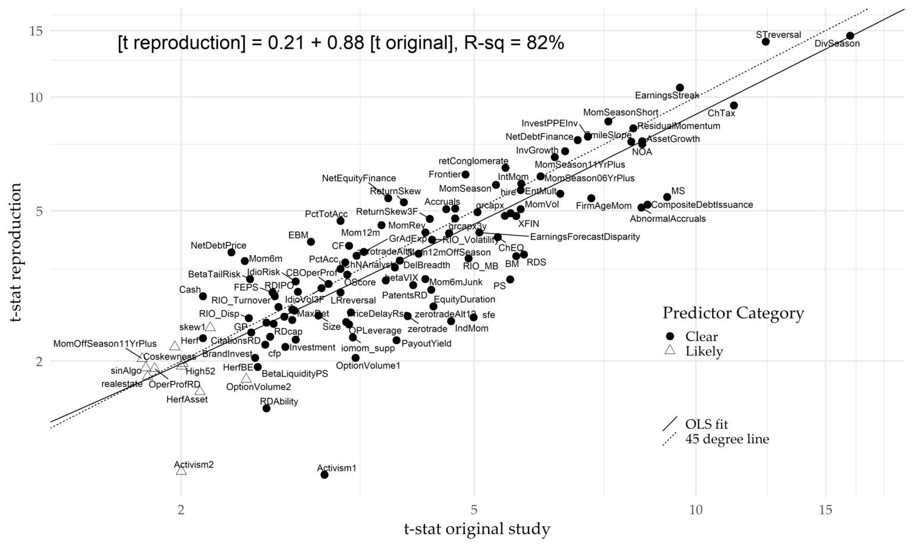

---
authors:
- admin
categories: []
date: "2021-07-01T00:00:00Z"
draft: false
featured: false
image:
  caption: ""
  focal_point: ""
projects: []
tags: []
title: 因子复现若干论文
---

# 论文1：

Jensen, T. I., Kelly, B. T., & Pedersen, L. H. (2021). Is There A Replication Crisis In Finance? (Working Paper Series). National Bureau of Economic Research. https://doi.org/10.3386/w28432。

他们使用贝叶斯方法研究了论文中的因子是否能复现的问题，并得出结论:

- 大多数因子确实是可以复现，而且在样本之外，在全球市场都表现出了一致性。

- 虽然有一小部分因子未能复现，但整体表现并没有大家认为的那么糟糕。

- 使用他们的贝叶斯方法，复现的成功率(超额收益在统计上显著)是85% ，而且这个结果在美国和全球数据都是一致的。

# 论文2

Chen, A. Y., & Zimmermann, T. (2021). Open Source Cross-Sectional Asset Pricing (SSRN Scholarly Paper ID 3604626). Social Science Research Network. https://doi.org/10.2139/ssrn.3604626.

他们详细整理了过去关于资产定价的学术文献中提及的319个因子，进行复现及测试。测试的数据及代码也在Github中开源，主要代码由Stata、R及SAS完成，他们根据原始出处的因子有效性的测试结果，作者将因子分为了以下四大类：

- Clear Predictor：long-short收益在统计上非常显著，总计161个

- Likely Predictor：long-short收益在统计上比较显著，总计44个

- Not-Predictor：long-short收益在统计上不显著，总计14个

- Indirect Signal：需与其他结合、或要做一些修改后才有预测性，总计100个

通过他们自己的测试，他们发现只有三个因子的测试结果与原论文不一致。对于原论文中的Clear  Predictor和Likely Predictor（共205个），作者对原文测试结果的t-value与复现后的t-value进行了回归，结果如下图，可以看出复现的结果和原论文非常接近。，t 统计数据的斜率为0.90，r 平方为83% ：

以上两篇论文引自公众号：***量化投资与机器学习：***
《美联储也研究因子模型？》

